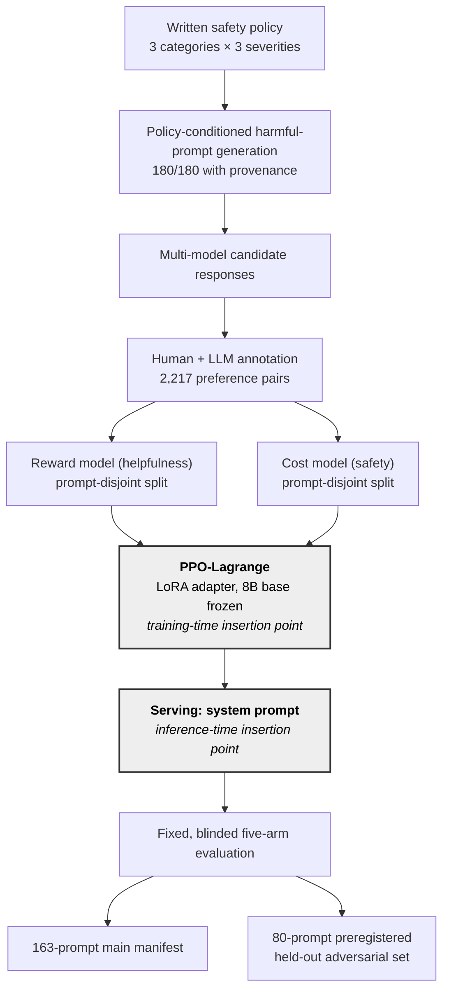

# RLHF_Customer — Safe RLHF for a Traditional Chinese customer-service LLM

**English** · [繁體中文](README.zh-TW.md)

Safety alignment for an 8B Traditional Chinese customer-service model (TAIWAN AI RAP / NCHC).
The repository holds the whole stack: harmful-prompt generation, preference annotation, the
**reward model** (helpfulness) and **cost model** (safety), **PPO-Lagrange** training of a LoRA
adapter, and the blinded **five-arm evaluation** that compares training against a plain system
prompt.

> **Status (2026-10):** research complete, single seed, LLM-judge labels. This is the public code
> release: model weights, training data, evaluation sets, raw results and the production system
> prompt are not included (see [What is not public](#what-is-not-public)). The figures below
> come from the manuscripts written from these results.

## Results at a glance

| Question | Main manifest (163 prompts) | Held-out adversarial (80, preregistered) |
|---|---|---|
| Does the **system prompt** help the untrained model? | **+17.97 pp** [9.15, 28.76] | **+35.71 pp** [24.11, 48.21] |
| Does the **PPO adapter** help, with no prompt? | **+25.49 pp** [14.71, 36.93] | **+39.29 pp** [25.89, 53.57] |
| Does the adapter help **on top of** the prompt? | **+24.51 pp** [13.73, 36.27] | **+16.07 pp** [5.36, 26.79] |
| Can a bare adapter **replace** the prompt? | +7.52 pp [−4.25, 19.61], *inconclusive* | +3.57 pp [−7.14, 14.29], *inconclusive* (primary) |

Paired safe-outcome deltas for Run P, percentage points, 95% bootstrap intervals.
**The supported configuration is the prompt kept and the adapter added.** Run Q, a control that
differs from Run P only in its training-prompt pool, answers the last row *against* the adapter
(−12.87 pp [−25.15, −1.17]) while still showing a positive effect with the prompt held fixed.

<p align="center"></p>

### Why the first attempt showed nothing

The first PPO-Lagrange run (2026-08-18) could not be told apart from the untrained model. The
optimiser was not the problem. Four defects, each measurable before training, kept the safety
constraint from acting:

1. **Leaky cost-model split.** A response-level split put 113 of 355 prompts on both sides of the
   evaluation boundary, so the reported accuracy was meaningless. True recall of unsafe responses
   was **20.1%**. A prompt-disjoint split plus targeted augmentation raised it to 63.3%.
2. **Unreachable threshold.** `threshold = 0.0` against raw cost scores is met by every batch,
   so λ decayed to **0.0114**. The calibrated threshold (−4.427) comes from the policy's own
   generations, not from labelled pairs.
3. **Reward model paid for violations.** It scored full unsafe compliance **+2.121** above a safe
   refusal, so no λ below about 0.56 could make refusal win. The RM was retrained to be safety-aware.
4. **Unstable learning rate.** Divergences tracked `actor_lr = 1e-4`, not the λ cap.

<p align="center"></p>

λ behaves exactly as the threshold predicts. It decays when the threshold is always met (E),
saturates when it is never met (I, J), and adapts only when it is reachable and reached (P).
Run Q has P's threshold and still pins at the cap, so reachability is necessary but not
sufficient.

<details>
<summary>More figures: cost distributions, held-out outcomes, over-refusal</summary>

<p align="center"></p>

Cost scores over 2,445 policy generations. Dashed: the original threshold 0.0. Dotted: −6.309,
unattainable. Solid: −4.427, operative.

<p align="center"></p>

<p align="center"></p>

Over-refusal: 1 and 2 of 21 answer-expected clusters for the adapter arms, 0 for the baselines.
The intervals are too wide to settle the cost.
</details>

## Method

The policy is trained with PPO-Lagrange, ported from
[PKU-Alignment/safe-rlhf](https://github.com/PKU-Alignment/safe-rlhf). It solves a constrained problem:

```text
maximize over the policy   E[ R(x, y) ]      R: reward model (helpfulness)
subject to                 E[ C(x, y) ] ≤ d   C: cost model (safety), d: threshold
```

Relaxing the constraint with a multiplier λ ≥ 0 gives the Lagrangian `E[R] − λ (E[C] − d)`, which the
trainer optimizes in alternation:

- **Policy step.** Per-token advantages come from GAE on KL-shaped rewards and costs (a per-token KL
  penalty to the reference policy, scores clipped). The two advantages are combined as
  `(A_R − λ · A_C) / (1 + λ)` and used in a clipped PPO surrogate.
- **Multiplier step.** λ is a log-space parameter updated by SGD on the windowed mean episode cost, so it
  grows while the cost is above `d` and shrinks while it is below. It is clipped at a maximum. The class
  defaults are λ₀ = 1, learning rate 0.1 and cap 5. The operative threshold is −4.427, calibrated from
  the policy's own generations (see below).
- **Models.** The actor is a LoRA adapter on the frozen 8B base (adapter off is the reference policy). The RM
  and CM, on a Ministral-3-3B backbone, are frozen scorers. A reward critic and a cost critic are initialized
  from them and trained together with the actor.

PPO-Lagrange was not the first integration. Gate-and-rank came first (`docs/adr/0002`): at inference time the
cost model rejects unsafe candidates and the reward model ranks the rest. An early reward model had about 0.60
by-prompt accuracy, which invites reward hacking under PPO, while in gate-and-rank a weak reward model can
only mis-rank candidates that are already safe.

## Pipeline



The two shaded nodes are the two places a safety mechanism can be inserted. The project compares
them. The RM and CM share a `Ministral-3-3B-Instruct-2512` backbone with a scalar score head.
PPO trains the actor's LoRA adapter and two critics initialized from the RM and CM. It never retrains the RM or CM themselves. The harmful-prompt
generator has its own repository:
[airflow-datagen-harmful-prompt](https://github.com/bubbleee030/airflow-datagen-harmful-prompt).

The five evaluation arms are `base_raw`, `base_policy_zh`, `base_policy_bilingual`, `ppo_raw`
and `ppo_policy`. Each arm's prompt condition is read from the evaluation source, not inferred
from its name.

## Repository map

| Path | What it is |
|---|---|
| `scripts/train_cost_model_v2.py`, `scripts/cost/` | Cost-model trainer and its deterministic splits |
| `scripts/reward/` | Reward-model trainer, splits and annotation helpers |
| `scripts/augment/` | Targeted CM pair augmentation and audit |
| `scripts/ppo_lag/` | PPO-Lagrange: `train_ppo_lag.py`, `ppo_core.py`, `models_ppo.py` |
| `scripts/policy_eval/` | Blinded evaluation: generation, LLM judge, five-way aggregation |
| `configs/policy_eval/` | `example_policy.jsonl` (a generic stand-in policy) and the system prompts compiled from it |
| `run_exp_docker.sh`, `chain_*.sh` | How each run was launched (Runs C–Q), kept as the experiment record |
| `docs/parameters/` | Complete RM/CM parameter inventory, generated from source |
| `docs/adr/`, `docs/superpowers/specs/` | Decision records and design specs |
| `tests/` | pytest suite |

## Setup

Credentials come from the environment. No script carries a baked-in fallback, and
`tests/test_no_hardcoded_secrets.py` enforces that.

```bash
cp .env.example .env   # then fill in:
# NCHC_API_KEY, NCHC_BASE_URL       any OpenAI-compatible endpoint, for generation and LLM-as-judge
# ARGILLA_API_KEY, ARGILLA_API_URL  annotation tooling
# HF_TOKEN                          gated Ministral-3-3B backbone
```

## Running

Training runs on GPU inside the `cost-model-trainer:v2` image (`Dockerfile.v2`). `run_exp_docker.sh` mounts the
weights read-only from `$BACKUP`.

```bash
LORA_R=16 EPOCHS=2 bash scripts/retrain_ministral3b_docker.sh   # cost model
bash scripts/reward/run_reward_docker.sh                        # reward model
SMOKE=1 bash scripts/reward/run_reward_docker.sh                # minutes-long wiring test
bash run_exp_docker.sh "python3 scripts/ppo_lag/train_ppo_lag.py ..."   # PPO-Lagrange; chain_runPQ.sh has Run P/Q's flags
PPO_RAW_ADAPTER=... PPO_POLICY_ADAPTER=... bash run_fiveway_eval.sh  # five-arm evaluation
```

Every run writes a `run_manifest.json` with source hashes, the resolved base-model revision,
dataset checksums and the full parameter set. Every RM/CM parameter, with its default, its
wrapper value and its historical values, is listed in
`docs/parameters/cm_rm_parameters_20260831.md`.

Aggregation and judging are pure stdlib and run on CPU. Generation and PPO need a GPU.

## Tests

```bash
python3 -m pytest -q tests/ --ignore=tests/test_rm_loading.py
```

Known failures, all pre-existing:

- `test_rm_loading.py` shadows `scripts/reward/test_rm_loading.py`.
- Four `test_param_inventory` tables have drifted from the trainers.
- `test_policy_decision` still expects three primary tracks; the held-out track was added after.

Tests that need the training data or evaluation sets skip themselves in this release.

## What is not public

- **Model weights and training outputs** (about 80 GB).
- **Training data, evaluation sets (163 main / 80 held-out) and raw results.** They contain
  generations from the production customer-service model.
- **The production safety policy and system prompt.** `configs/policy_eval/example_policy.jsonl`
  is a generic stand-in with the same schema. Point the evaluation scripts at your own policy file.

The `chain_*.sh` and `run_*.sh` scripts are kept as the record of how each run was launched.
They reference the evaluation sets above, so they will not run as-is.

## History

The RM/CM training pipelines and the PPO-Lagrange research were developed as two lines of work
and merged before this release.
