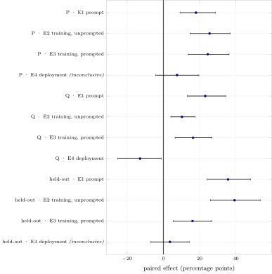
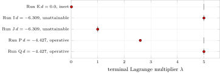
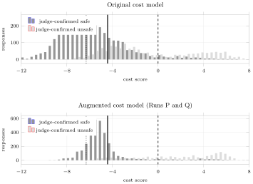
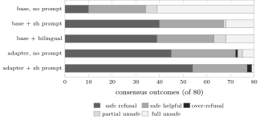
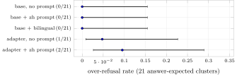
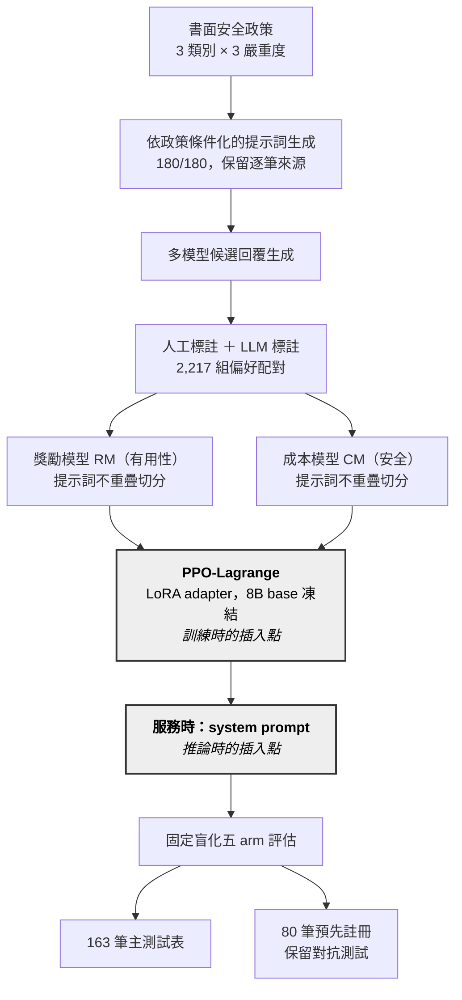

# RLHF_Customer — 繁體中文客服模型的 Safe RLHF

[English](README.md) · **繁體中文**

這個 repository 是 TAIWAN AI RAP／國網中心 8B 繁體中文客服模型的安全對齊，內容涵蓋整條流程：
- 有害提示詞生成
- 偏好標註
- **獎勵模型 RM**（有用性）與**成本模型 CM**（安全）
- 以 **PPO-Lagrange** 訓練 LoRA adapter
- 盲化的**五 arm 評估**，比較「訓練」與「單純 system prompt」

> **狀態（2026-10）：** 研究已完成，單一 seed，標籤來自 LLM judge。這是公開的程式碼版本，
> 不含模型權重、訓練資料、評估集、原始結果和正式的 system prompt（見[未公開的內容](#未公開的內容)）。
> 下面的圖取自根據這些結果寫成的論文稿。

## 結果一覽

| 問題 | 主測試表（163 筆） | 保留對抗測試（80 筆，預先註冊） |
|---|---|---|
| **system prompt** 對未訓練模型有幫助嗎？ | **+17.97 pp** [9.15, 28.76] | **+35.71 pp** [24.11, 48.21] |
| 沒有 prompt 時，**PPO adapter** 有幫助嗎？ | **+25.49 pp** [14.71, 36.93] | **+39.29 pp** [25.89, 53.57] |
| 在 prompt **之上再加** adapter 有幫助嗎？ | **+24.51 pp** [13.73, 36.27] | **+16.07 pp** [5.36, 26.79] |
| 單獨的 adapter 能**取代** prompt 嗎？ | +7.52 pp [−4.25, 19.61]，*無定論* | +3.57 pp [−7.14, 14.29]，*無定論*（主要指標） |

表中是 Run P 的成對 safe-outcome 差值，單位為百分點，括號內是 95% bootstrap 信賴區間。
**證據支持的配置是：保留 prompt，再加上 adapter。**

Run Q 是對照組，跟 Run P 只差在訓練用的提示詞池。它在最後一列給出*不利於* adapter 的結果（−12.87 pp [−25.15, −1.17]）；但在 prompt 固定的條件下，訓練效果仍然是正的。

<p align="center"></p>

### 為什麼第一次訓練看不出效果

第一次 PPO-Lagrange（2026-08-18）訓練出的模型跟未訓練的模型分不出差別。問題不在最佳化本身，而是有四個缺陷讓安全約束根本沒有作用，而且每一個都能在訓練前測出來：

1. **CM 的資料切分洩漏。** 以回覆為單位切分，結果 355 個提示詞中有 113 個同時出現在評估邊界的兩側，報出來的準確率沒有意義。不安全回覆的真實召回率只有 **20.1%**。改成依提示詞不重疊切分、再加上針對性的資料擴增後，提高到 63.3%。
2. **閾值無法觸及。** 對原始成本分數設 `threshold = 0.0`，每個 batch 都滿足，所以 λ 一路衰減到 **0.0114**。校準後的閾值（−4.427）是用 policy 自己的生成結果算出來的，不是用標註好的配對。
3. **RM 會獎勵違規。** 完全照做不安全請求的分數比安全拒絕高 **+2.121**，所以 λ 低於約 0.56 時，拒絕永遠贏不了。後來改用重新訓練、具安全意識的 RM。
4. **學習率不穩定。** 訓練發散跟 `actor_lr = 1e-4` 有關，跟 λ 上限無關。

<p align="center"></p>

λ 的行為完全符合閾值的預測：
- 閾值永遠被滿足時，λ 衰減（E）。
- 閾值永遠無法被滿足時，λ 卡在上限（I、J）。
- 只有在閾值觸及得到、而且真的觸及時，λ 才會調整（P）。

Run Q 用的閾值跟 P 一樣，λ 卻仍然卡在上限，所以「觸及得到」是必要條件，但不是充分條件。

<details>
<summary>更多圖：成本分佈、保留集結果、過度拒絕</summary>

<p align="center"></p>

2,445 筆 policy 生成結果的成本分數分佈。圖中三條線：
- 虛線：原本的閾值 0.0。
- 點線：−6.309，觸及不到。
- 實線：−4.427，可以運作。

<p align="center"></p>

<p align="center"></p>

過度拒絕的情況：在 21 個應該回答的群組中，adapter 的兩個 arm 各有 1 和 2 個，baseline 都是 0。信賴區間太寬，還無法判斷這個代價有多大。
</details>

## 流程



- 兩個灰底節點是可以插入安全機制的兩個位置：訓練時的 adapter，以及服務時的 system prompt。本專案比較的就是這兩者。
- RM 和 CM 共用 `Ministral-3-3B-Instruct-2512` backbone，加上一個純量分數頭。
- PPO 只訓練 actor 的 LoRA adapter，不會重新訓練 RM 或 CM。
- 有害提示詞生成器在另一個 repo：[airflow-datagen-harmful-prompt](https://github.com/bubbleee030/airflow-datagen-harmful-prompt)。

五個評估 arm 是 `base_raw`、`base_policy_zh`、`base_policy_bilingual`、`ppo_raw`、`ppo_policy`。每個 arm 用的是哪種 prompt，是從評估程式碼讀出來的，不是從名稱推測。

## 目錄導覽

| 路徑 | 內容 |
|---|---|
| `scripts/train_cost_model_v2.py`、`scripts/cost/` | CM 訓練程式與確定性切分 |
| `scripts/reward/` | RM 訓練程式、切分、標註工具 |
| `scripts/augment/` | 針對性的 CM 配對擴增與稽核 |
| `scripts/ppo_lag/` | PPO-Lagrange：`train_ppo_lag.py`、`ppo_core.py`、`models_ppo.py` |
| `scripts/policy_eval/` | 盲化評估：生成、LLM judge、五 arm 彙整 |
| `configs/policy_eval/` | `example_policy.jsonl`（通用的範例政策）和由它編譯出的 system prompt |
| `run_exp_docker.sh`、`chain_*.sh` | 每個 run（C–Q）的實際啟動方式，保留作為實驗紀錄 |
| `docs/parameters/` | RM／CM 的完整參數清單，由原始碼自動產生 |
| `docs/adr/`、`docs/superpowers/specs/` | 決策紀錄、設計規格 |
| `tests/` | pytest 測試 |

## 設定

憑證一律從環境變數讀取。任何 script 都不寫死預設值，`tests/test_no_hardcoded_secrets.py` 會檢查這一點。

```bash
cp .env.example .env   # 填入：
# NCHC_API_KEY、NCHC_BASE_URL       任何 OpenAI 相容的 API，用於生成與 LLM-as-judge
# ARGILLA_API_KEY、ARGILLA_API_URL  標註工具
# HF_TOKEN                          Ministral-3-3B gated backbone
```

## 執行

訓練要在 GPU 上、`cost-model-trainer:v2` 映像（`Dockerfile.v2`）裡跑。`run_exp_docker.sh` 會以唯讀方式從 `$BACKUP` 掛載權重。

```bash
LORA_R=16 EPOCHS=2 bash scripts/retrain_ministral3b_docker.sh   # 成本模型
bash scripts/reward/run_reward_docker.sh                        # 獎勵模型
SMOKE=1 bash scripts/reward/run_reward_docker.sh                # 幾分鐘的接線測試
bash run_exp_docker.sh "python3 scripts/ppo_lag/train_ppo_lag.py ..."   # PPO-Lagrange；Run P/Q 的參數見 chain_runPQ.sh
PPO_RAW_ADAPTER=... PPO_POLICY_ADAPTER=... bash run_fiveway_eval.sh  # 五 arm 評估
```

每個 run 都會寫出 `run_manifest.json`，內容包括原始碼雜湊、解析後的 base model 版本、資料集 checksum，以及完整的參數設定。RM／CM 每個參數的預設值、wrapper 實際傳入的值、歷次 run 用過的值，都列在 `docs/parameters/cm_rm_parameters_20260831.zh-TW.md`。

彙整和 judge 只用標準函式庫，CPU 就能跑；生成和 PPO 需要 GPU。

## 測試

```bash
python3 -m pytest -q tests/ --ignore=tests/test_rm_loading.py
```

以下是已知的失敗，合併前就存在：
- `test_rm_loading.py` 跟 `scripts/reward/test_rm_loading.py` 同名，互相遮蔽。
- 有 4 個 `test_param_inventory` 的表格跟訓練程式不同步了。
- `test_policy_decision` 仍然預期 3 個主要評估軌，但保留集這一軌是後來才加的。

需要訓練資料或評估集的 test，在這個版本會自動 skip。

## 未公開的內容

- **模型權重與訓練輸出**（約 80 GB）。
- **訓練資料、評估集（163 主測試／80 保留集）和原始結果。** 裡面有正式客服模型的生成內容。
- **正式的安全政策與 system prompt。** `configs/policy_eval/example_policy.jsonl` 是格式相同的通用範例，請改成你自己的政策檔。

`chain_*.sh` 和 `run_*.sh` 保留下來，作為每個 run 實際啟動方式的紀錄。它們會用到上面那些評估集，所以無法直接執行。

## 歷史

RM／CM 訓練流程和 PPO-Lagrange 研究原本是兩條工作線，在這次公開前合併。
